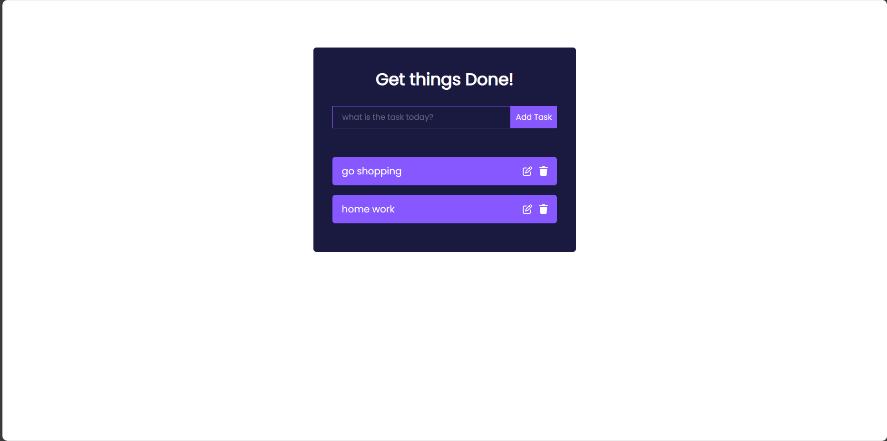
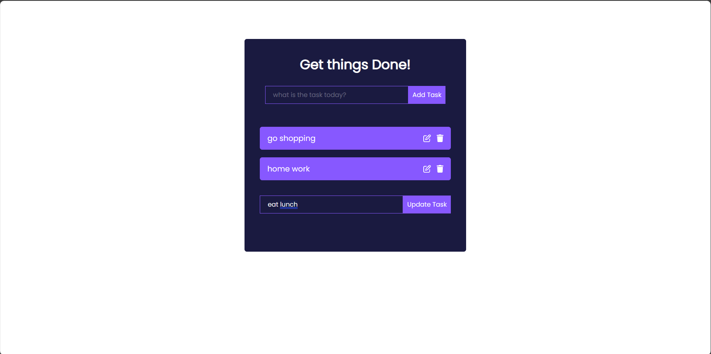

# React-Todo-List-App
A React-based Todo-App designed for efficient task management. This repository contains a user-friendly and intuitive Todo-App built using React, enabling users to create, track, and organize their tasks seamlessly. The application offers features for adding, editing, and deleting tasks.

## Preview

Before adding the tasks the app looks like this...

After adding the tasks the app looks like this...

Editing a task...

